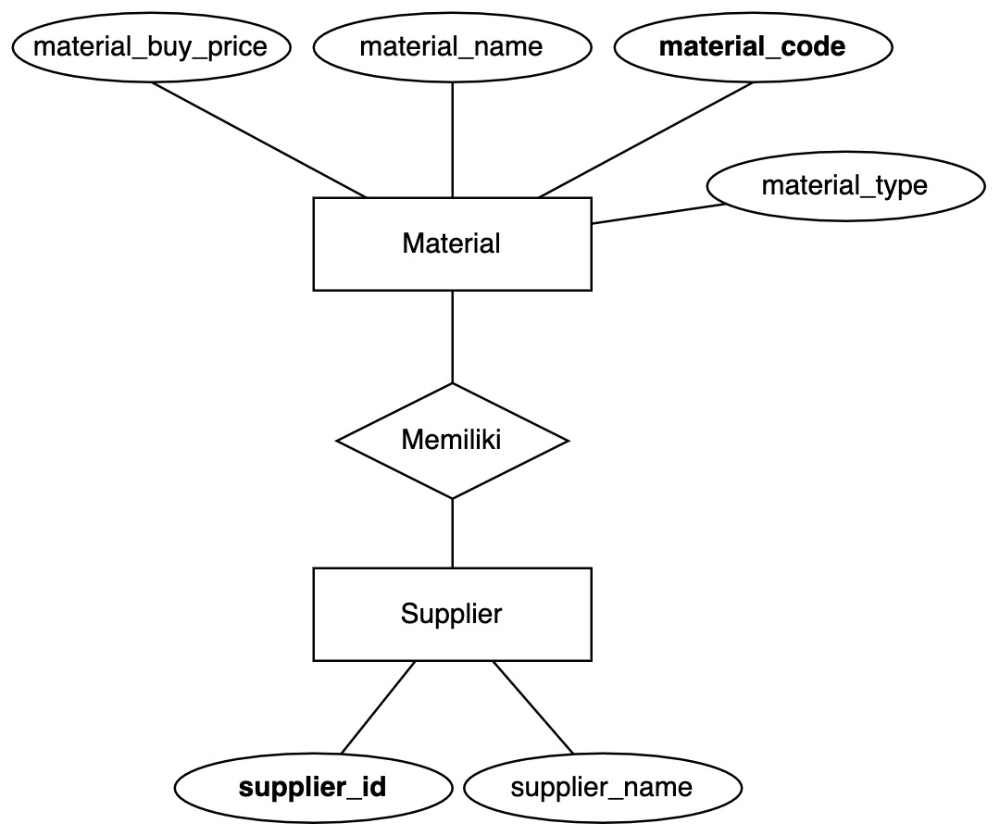

# Keda Test: Making a Backend of Registration of Material

## Steps

1. Clone this repository
```
git clone https://github.com/muhrianal/kedatest.git
```
2. Make your virtual environment and activate it
3. Install all the requirements
```
pip install -r requirements.txt
```
4. You need to create superuser to access admin page to create Supplier data
```
python manage.py createsuperuser
```
4. Run the app (migrate it first, of course:v )
```
python manage.py makemigrations
python manage.py migrate
python manage.py runserver
```
5. Go to the admin page, login with superuser account you just made and make at least one Supplier account there
6. Go to home http://localhost:8000 and you'll see the API Overview there
7. You can use all of the API now


## Addition

1. JSON payload example for create and update (you can use this for testing):
```json
{
    "material_code": "ABCDEF1234",
    "material_name": "Awesome long pants",
    "material_type": "Jeans",
    "material_buy_price": 385000,
    "supplier": 1
}
```

2. To test the unittest you can run this command on terminal
```
coverage run --source='.' manage.py test
```

To see the result, run:
```
coverage report
```

To see the more comprehensive test result, run:
```
coverage html
```

3. The ERD 


note on ERD: The material type is basically an attribute here, since it only has three options (Fabric, Jeans, Cotton). But it can also be a separated entity if needed like when you have a lot of options and you can CRUD on it.